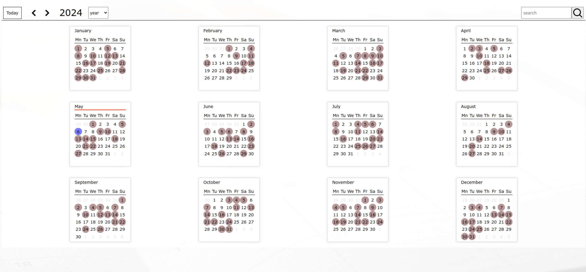
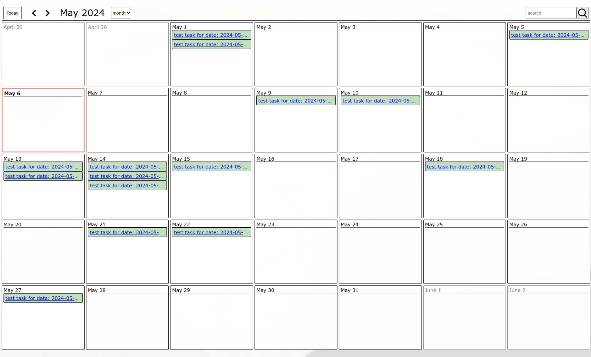
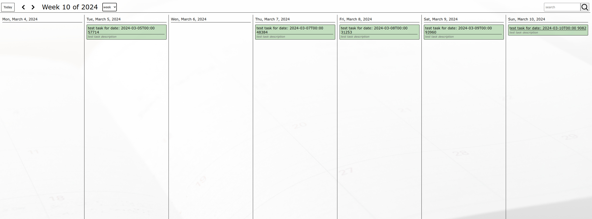
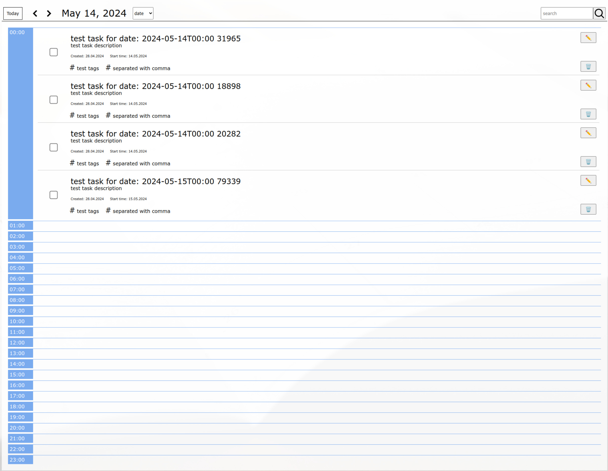
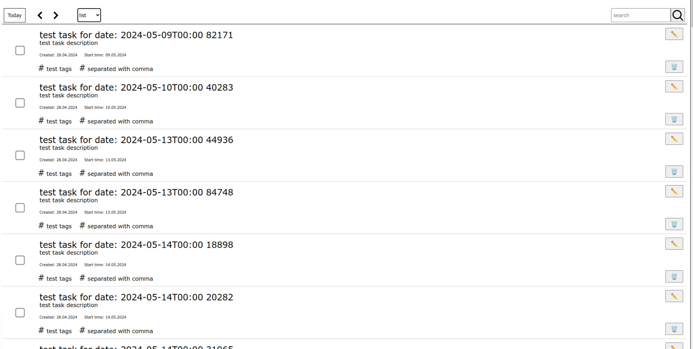
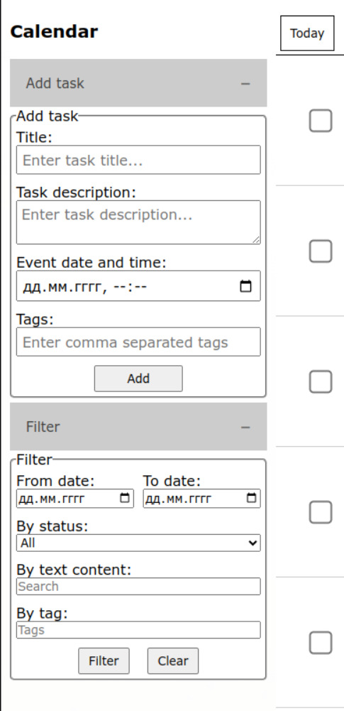

# Календарь событий с авторизацией

[](https://github.com/v-nvtsk/otus-jsbasic-final-react/actions/workflows/lint-test.yaml)

[](https://github.com/v-nvtsk/otus-jsbasic-final-react/actions/workflows/playwright.yml)
[](https://github.com/v-nvtsk/otus-jsbasic-final-react/actions/workflows/deploy-gh-pages.yaml)


> Приложение для создания и контроля событий в календаре

---

## Локальный запуск

После выполнения команды приложение будет доступно по адресу: http://localhost:3000

```sh
npm install
npm start
```

Возможна регистрация новых пользователей по email и паролю. Адрес электронной почты можно изменить после логина.

Все представления позволяют:

- создавать, редактировать, удалять задачи (заголовок, описание, статус выполнения, дата)
- фильтровать по статусу выполнения, дате, тексту в названии и в описании, тегам

Варианты страниц календаря:  
Вид года:  


Вид Месяца:  


Вид недели:  


Вид дня:  


Список дел:  


Добавление и фильтрация в боковой панели  
 

## TODO

- Не учитывается продолжительность события
- Не разделены объекты: событие и задача
- База данных не позволяет хранить даты, приходится хранить в number
- База данных не позволяет искать по тексту в полях
- Заголовки окна при переходах между страницами - обновляются неадекватно

- Недоработан алгоритм отображения списка:  
  отображаются задачи с сегодняшнего дня и далее.  
  чтобы отобразить предшествующие дни надо выставить фильтр

- сделать [fuzzy search](https://whatis.techtarget.com/definition/fuzzy-search) (можно взять [`Fuzzy search`](https://www.npmjs.com/package/fuzzy-search))
- состояние должно отображаться на url (чтобы его можно было сохранять в закладки)
